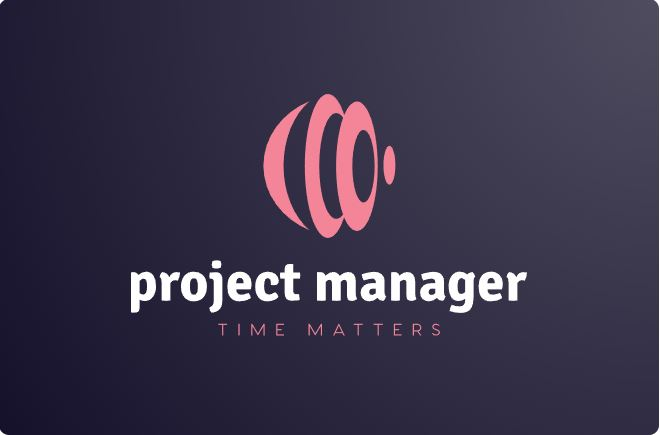
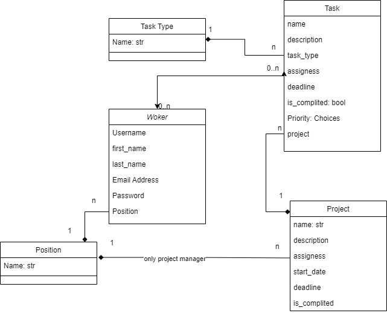
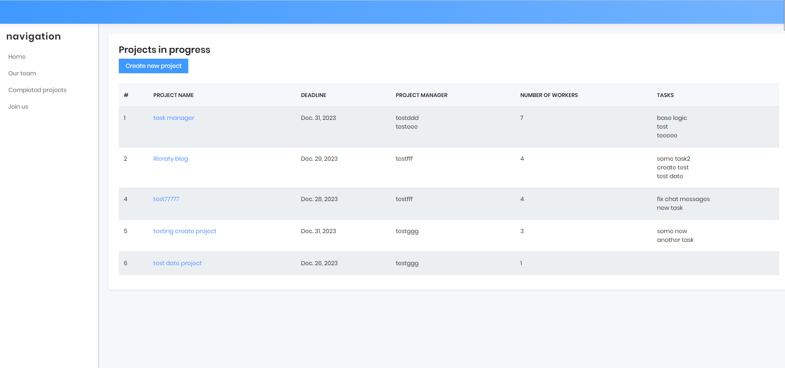

# Company Project Manager

Project to manage the company’s employees and tasks.

## Mission
This completely useless for commercial use project was created to train in the development of a web application based on Django and to blow the minds of my mentors.

The second goal of this project is to demonstrate to future employers that I am capable of writing something more significant than just 'Hello, world'.

## Description

This app created to make life easier for managers.
- Create project and control its execution.
- Add tasks for project and assign workers.

Each project has project manager.
Each task has his own deadline and workers.

You can control:
- how many projects in progress
- tasks finished or not 
- how many tasks has each worker
- and many other things ..


## Getting Started

These instructions will get you a copy of the project up and running on your local machine for development and testing purposes. See deployment for notes on how to deploy the project on a live system.

### Prerequisites

Must have:
- a computer with some operating system (maybe mobile phone but
a don't know how to use python on it yet)
- some free time

### Installing

A step by step series of examples that tell you how to get a development env running

1. Say what the step will be
    ```
    git clone the-link-from-forked-repo
    ```
2. Open the project folder in your IDE
3. If you are using PyCharm - it may propose you to automatically create venv for your project and install requirements in it, but if not:
    ```
    python -m venv venv
    venv\Scripts\activate (on Windows)
    source venv/bin/activate (on macOS)
    pip install -r requirements.txt
    ```

4. Use the following command to load prepared data from fixture to test code:
    ```
    python manage.py loaddata db_comp.json
    ```

5. After loading data from fixture you can use following superuser (or create another one by yourself):
  - Login: `admin.test`
  - Password: `test4444`

### DB Structure:



### Main page:
